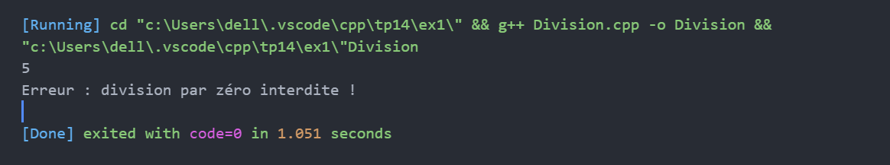
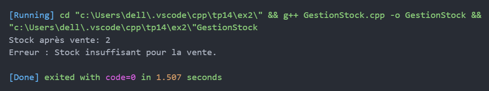
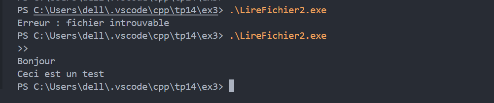

# TP14 : Gestion des exceptions en C++

## Exercice 1 — Division sécurisée  
Fonction `diviser(int a, int b)` avec gestion d’exception pour division par zéro.

---

## Exercice 2 — Stock de produits  
Classe `Produit` avec exception personnalisée `StockInsuffisantException` lors d’une vente dépassant le stock.

---

## Exercice 3 — Lecture de fichier  
Lecture ligne par ligne d’un fichier avec gestion d’exception si le fichier est introuvable.

---

## Exercice 4 — Simulation bancaire  
Classe `Compte` avec exceptions `MontantInvalideException` et `SoldeInsuffisantException` pour opérations invalides.

